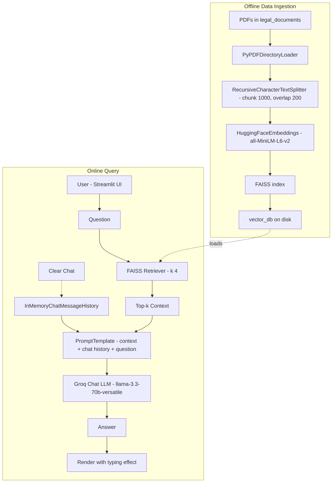

<p align="center">
  
</p>

# Saul Botman ⚖️

A sophisticated legal assistant inspired by Better Call Saul utilizing RAG architecture, advanced language models and embeddings to retrieve and generate contextually relevant answers from a provided legal document corpus designed to provide accurate information about the Indian Penal Code (IPC).

**🔥 Try it now: [Saul Botman Live](https://saul-botman.streamlit.app/)**

## Technical Stack 🛠️

- **Frontend**: Streamlit with custom CSS theming
- **LLM Integration**: Groq's llama-3.3-70b-versatile
- **Embeddings**: HuggingFace sentence-transformers/all-MiniLM-L6-v2
- **Vector Store**: FAISS for efficient similarity search
- **Document Processing**: langchain_text_splitters RecursiveCharacterTextSplitter
- **Memory**: InMemoryChatMessageHistory for lightweight chat history

## Features ✨

- Clean and intuitive user interface
- Streamlined conversation experience with legal context
- Vector-based similarity search for relevant IPC sections
- Real-time document retrieval and context analysis
- Conversation memory for maintaining context
- Custom prompt engineering for legal responses

## Installation 🚀

1. Clone the repository:
```bash
git clone https://github.com/NiteeshL/Saul-Botman.git
cd Saul-Botman
```

2. Create a virtual environment:
```bash
python -m venv venv
source venv/bin/activate  # On Windows use: venv\Scripts\activate
```

3. Install dependencies:
```bash
pip install -r requirements.txt
```

4. Configure API Keys:
Create a `.env` file in the root directory with the following:
```env
GROQ_API_KEY=your_groq_api_key_here
```

To obtain the API keys:
- Get your Groq API key from [Groq Cloud](https://console.groq.com/keys)

## Data Processing 📚

The system processes Indian Penal Code documents through the following pipeline:
1. PDF documents are loaded from the `legal_documents` directory
2. Documents are split into chunks of 1000 characters with 200 character overlap
3. Text chunks are embedded using HuggingFace sentence-transformers/all-MiniLM-L6-v2
4. Embeddings are stored in a FAISS vector database for efficient retrieval

**Note**: You can expand the knowledge base by adding more PDF documents to the `legal_documents` folder. After adding new documents, simply run `python data_ingestion.py` again to update the vector database with the new content.

## Usage 💡

1. Place your IPC documents in the `legal_documents` directory

2. Run the data ingestion script:
```bash
python data_ingestion.py
```

3. Start the Streamlit app:
```bash
streamlit run app.py
```

The application will open in your default web browser at `http://localhost:8501`.

## Query Processing Flow 🔄

1. User input is processed through the Streamlit chat interface
2. Relevant IPC sections are retrieved using FAISS similarity search (k=4)
3. Context is combined with the user query and recent chat history using a custom PromptTemplate
4. Response is generated using the Groq LLM (llama-3.3-70b-versatile)
5. Chat history is maintained via InMemoryChatMessageHistory (last two exchanges)

## Architecture Diagram 🗺️



## Contributing 🤝

Contributions are welcome! Please feel free to submit a Pull Request.

## License 📄

This project is licensed under the MIT License - see the [LICENSE](LICENSE) file for details.


